# C# Constitution

> Rust-inspired pragmatic principles for C# architecture.
> Compile-time safety. Explicit dependencies. Composition over inheritance.

**Version**: 2.0
**Last Updated**: 2026-02-23
**Amendment Process**: Changes require documentation, team review, and updated version number.

---

## How to Use This Document

This constitution works at **three speeds**:

1. **Dashboard** (§1) — Glance at the quick-reference table or decision flowcharts when you're in the weeds and something feels off.
2. **Principle Cards** (§2–§8) — Each principle follows an identical template. Scan for the part you need: the lens, the smell, the example, the nuance.
3. **Appendices** (§9) — ADR templates, analyzer rules, glossary, and naming conventions for deep dives or onboarding.

Every principle card follows this template:

```
### Principle Name
> One-sentence bumper sticker

**The Lens**: The question to ask yourself
**Smell**: How to spot a violation
**✅ Do this**: (C# example)
**❌ Not this**: (C# counter-example)
**Nuance**: When to break this rule
**Further Reading**: 1–2 links
```

---

## §1 — Dashboard

### Quick Reference Table

| When you see... | Consider... | Principle |
|---|---|---|
| `throw new` for validation | Return `Result<T, Error>` | [Result over Exceptions](#24-result-over-exceptions) |
| `: BaseService` | Composition via interfaces | [Composition via Interfaces](#32-composition-via-interfaces) |
| `protected` methods | Extract to injectable interface | [Composition via Interfaces](#32-composition-via-interfaces) |
| `string styleName` parameter | Create `StyleName` value object | [No Primitive Obsession](#14-no-primitive-obsession) |
| `Guid documentId` | Create strongly-typed `DocumentId` | [No Primitive Obsession](#14-no-primitive-obsession) |
| `ServiceLocator.Get<T>()` | Constructor injection | [Explicit Dependencies](#43-explicit-dependencies) |
| `IConfiguration["key"]` | `IOptions<TSettings>` | [Options Pattern](#55-options-pattern) |
| `string?` or nullable everywhere | `Maybe<T>` for optional domain values | [Maybe over Null](#15-maybe-over-null) |
| Copy-pasted logic | Extract to single source | [DRY](#61-dry) |
| `// TODO: fix later` | Fix now or create tracked issue | [Broken Windows](#62-broken-windows) |
| God-class / >200 LOC | Extract per SRP | [Single Responsibility](#31-single-responsibility-principle) |
| Class named "Manager/Helper/Util" | Apply SRP | [Single Responsibility](#31-single-responsibility-principle) |
| A method that returns data AND changes state | Split into query + command | [Command-Query Separation](#21-command-query-separation) |
| Reading state then deciding externally | Move logic inside the object | [Tell Don't Ask](#33-tell-dont-ask) |
| `order.Customer.Address.City` | Only talk to direct collaborators | [Law of Demeter](#34-law-of-demeter) |
| Null check at layer 3 of 5 | Fail at the boundary, trust the type after | [Fail Fast](#22-fail-fast) |
| `CalculateTotal()` that also logs | Separate concerns; name honestly | [Principle of Least Astonishment](#65-principle-of-least-astonishment) |
| An interface with methods nobody implements | Narrow the interface | [Interface Segregation](#35-interface-segregation) |
| `Penguin.Fly()` → `throw NotSupportedException` | Hierarchy is wrong | [Liskov Substitution](#36-liskov-substitution) |
| Infrastructure project defines the interface | Domain owns the interface | [Dependency Inversion](#44-dependency-inversion) |
| Stripe's `PaymentIntent` in your domain | Anti-Corruption Layer | [Anti-Corruption Layer](#46-anti-corruption-layer) |
| Same 3 fields appear together everywhere | Extract a value object | [No Primitive Obsession](#14-no-primitive-obsession) |
| Methods with 4+ parameters | Introduce a command/parameter object | [Single Responsibility](#31-single-responsibility-principle) |
| `Process(document, true, false)` | Replace booleans with enums or separate methods | [Principle of Least Astonishment](#65-principle-of-least-astonishment) |
| `DateTime.Now` used directly | Inject `IDateTimeProvider` | [Explicit Dependencies](#43-explicit-dependencies) |
| Entities with only getters/setters | Move behaviour into entities | [Tell Don't Ask](#33-tell-dont-ask) |
| Interface with exactly 1 implementation "just in case" | YAGNI — add when you need it | [YAGNI](#63-yagni) |
| Deep `if` nesting (arrow code) | Guard clauses, early return, or Result chains | [Fail Fast](#22-fail-fast) |
| Comments explaining *what* code does | Delete it. Only comment *why*. | [Principle of Least Astonishment](#65-principle-of-least-astonishment) |
| Two nearly identical classes extracted to a shared base | Is it *actually* the same concept, or coincidence? | [Rule of Three](#64-rule-of-three) |
| Loading multiple root entities in one transaction | Your aggregate boundaries are wrong | [Aggregates](#45-aggregates-and-domain-events) |
| `.Result` or `.Wait()` on an async call | Async all the way — this deadlocks | [Async Patterns](#async-patterns) |

### Decision Flowcharts

#### "Something Feels Wrong" — Principle Selector

```mermaid
flowchart TD
    START["🤔 Something feels off"] --> Q1{"What kind of\nproblem?"}

    Q1 -->|"Types / data shape"| TYPE_Q{"What specifically?"}
    Q1 -->|"Method / function design"| METHOD_Q{"What specifically?"}
    Q1 -->|"Class / object design"| CLASS_Q{"What specifically?"}
    Q1 -->|"Architecture / boundaries"| ARCH_Q{"What specifically?"}
    Q1 -->|"General unease"| META_Q{"What specifically?"}

    TYPE_Q -->|"Passing raw strings/ints\nfor domain concepts"| P_PRIM["No Primitive Obsession\n→ Create value objects"]
    TYPE_Q -->|"Nulls creeping in"| P_MAYBE["Maybe over Null\n→ Maybe<T>"]
    TYPE_Q -->|"Object can exist\nin invalid state"| P_ILLEGAL["Make Illegal States\nUnrepresentable"]
    TYPE_Q -->|"Validating the same\nthing in multiple places"| P_PARSE["Parse Don't Validate\n→ Trusted types at boundary"]

    METHOD_Q -->|"Method returns data\nAND changes state"| P_CQS["Command-Query Separation\n→ Split into two methods"]
    METHOD_Q -->|"Method hides possible\nfailure outcomes"| P_HONEST["Honest Functions\n→ Result<T> / Maybe<T>"]
    METHOD_Q -->|"Throwing exceptions for\nexpected failures"| P_RESULT["Result over Exceptions\n→ Result<T, Error>"]
    METHOD_Q -->|"Accepting invalid input\nthen checking later"| P_FAIL["Fail Fast\n→ Guard clauses at entry"]

    CLASS_Q -->|"Class does too\nmany things"| P_SRP["Single Responsibility\n→ Extract classes"]
    CLASS_Q -->|"Reading state then\ndeciding externally"| P_TELL["Tell Don't Ask\n→ Move logic into object"]
    CLASS_Q -->|"Chaining through\nobject graphs"| P_LOD["Law of Demeter\n→ Talk to friends only"]
    CLASS_Q -->|"Fat interfaces with\nunused methods"| P_ISP["Interface Segregation\n→ Narrow interfaces"]
    CLASS_Q -->|"Inheritance tree\nfeels wrong"| P_COMP["Composition via Interfaces\n+ Liskov Substitution"]

    ARCH_Q -->|"Business logic\ntouches database/APIs"| P_PURE["Pure Core / Impure Shell\n→ Push effects to edges"]
    ARCH_Q -->|"External model leaking\ninto domain"| P_ACL["Anti-Corruption Layer\n→ Translate at boundary"]
    ARCH_Q -->|"Hidden dependencies"| P_EXPLICIT["Explicit Dependencies\n→ Constructor injection"]
    ARCH_Q -->|"Domain doesn't own\nits interfaces"| P_DIP["Dependency Inversion\n→ Domain defines contracts"]

    META_Q -->|"Premature abstraction"| P_YAGNI["YAGNI + Rule of Three\n→ Wait for 3 instances"]
    META_Q -->|"Code is hard\nto understand"| P_POLA["Principle of Least\nAstonishment → Simplify"]
    META_Q -->|"Small mess becoming\nbig mess"| P_BROKEN["Broken Windows\n→ Fix now or track it"]
    META_Q -->|"Following a rule that\nmakes things harder"| P_DOGMA["Avoid Dogmatism\n→ Context over rules"]
```



#### "How Should I Handle This Error?"


#### "Should I Create an Abstraction?"


#### "Where Does This Logic Belong?"


---

## §2 — Type System & Safety

These principles enforce correctness at compile time. They answer: *"Can I make it impossible to represent this bug?"*

### 2.1 Make Illegal States Unrepresentable

> If a bug can't compile, it can't ship.

**The Lens**: "Can an instance of this type ever exist in an invalid state?"

**Smell**: Public constructors on domain types. Mutable properties without invariant checks. A type where certain field combinations are meaningless.

**✅ Do this**:

```csharp
public sealed class DocumentId
{
    public Guid Value { get; }

    private DocumentId(Guid value) => Value = value;

    public static Result<DocumentId, Error> Create(Guid value)
    {
        if (value == Guid.Empty)
            return Result.Failure<DocumentId, Error>(
                DomainErrors.DocumentId.Empty);

        return new DocumentId(value);
    }
}
```

**❌ Not this**:

```csharp
public class DocumentId
{
    public Guid Value { get; set; } // Can be set to Guid.Empty at any time
}
```

**❌ Not this either** — a type where field combinations are meaningless:

```csharp
// A document can be Draft (no reviewer) or UnderReview (requires reviewer).
// This class allows reviewer to be set on a Draft — an illegal state.
public class Document
{
    public DocumentStatus Status { get; set; }
    public string? ReviewerName { get; set; } // Meaningless when Status == Draft
}
```

**✅ Instead, make each state its own type**:

```csharp
public abstract record DocumentState;
public sealed record Draft(string Content) : DocumentState;
public sealed record UnderReview(string Content, string ReviewerName) : DocumentState;
```

**Think of it like a vending machine**: you physically can't insert a note upside down because the slot is shaped to prevent it. Shape your types so invalid states can't physically fit.

**Techniques**:

- Private constructors with factory methods returning `Result<T, Error>`
- `sealed` classes by default
- `readonly record struct` for value types
- `required` properties for mandatory fields
- Discriminated union patterns for mutually exclusive states

**Nuance**: Not everything needs a factory method. Simple DTOs, test fixtures, and internal helpers can use regular constructors. Apply this to domain types that have invariants to protect.

**Further Reading**: [Designing with Types (F# for Fun and Profit)](https://fsharpforfunandprofit.com/series/designing-with-types/) — the concepts translate directly to C#.

---

### 2.2 Fail Fast

> Invalid state detected? Stop NOW. Don't let it travel.

**The Lens**: "If this value is invalid, how far does it get before something notices?"

**Smell**: Null checks buried deep inside a method. Validation scattered across layers. A `NullReferenceException` three stack frames away from where the null was introduced.

**✅ Do this** — Guard clauses for programmer errors:

```csharp
public sealed class StyleApplicator
{
    private readonly IDocumentService _documentService;

    public StyleApplicator(IDocumentService documentService)
    {
        _documentService = documentService
            ?? throw new ArgumentNullException(nameof(documentService));
    }

    public Result<Unit, Error> ApplyStyle(StyleName styleName, Range range)
    {
        // Domain validation returns Result — not an exception
        if (!_documentService.StyleExists(styleName))
            return Result.Failure<Unit, Error>(
                DomainErrors.Style.NotFound(styleName));

        // ... apply style
        return Result.Success<Unit, Error>(Unit.Value);
    }
}
```

**❌ Not this** — letting invalid state travel:

```csharp
public void ApplyStyle(string styleName, Range range)
{
    // No guard. styleName could be null or empty.
    // Might crash three methods deep when Word COM chokes.
    var style = _document.Styles[styleName]; // 💥 COMException here
}
```

**The three-tier error hierarchy**:

| Error type | Mechanism | Example |
|---|---|---|
| **Programmer error** (bug) | `throw` — guard clauses | `ArgumentNullException`, `InvalidOperationException` |
| **Domain error** (expected) | `Result.Failure()` | Insufficient permissions, style not found |
| **Infrastructure error** (transient) | Retry via Polly, then `Result.Failure()` | Network timeout, COM disconnection |
| **Configuration error** | Validate at startup | Missing API key, invalid connection string |

**Think of it like a factory assembly line**: a defective part should trigger the stop cord immediately, not travel down the line until it jams a machine three stations later.

**Nuance**: Fail Fast applies to *detection*, not *user experience*. Detect fast, but present errors gracefully. Guard clauses in constructors; friendly messages in the UI layer.

**Further Reading**: [Fail Fast Principle (Enterprise Craftsmanship)](https://enterprisecraftsmanship.com/posts/fail-fast-principle/)

---

### 2.3 Parse, Don't Validate

> Validate once at the boundary. Transform into a trusted type. Never validate again.

**The Lens**: "Am I checking this value's validity here because I don't trust it? Why don't I trust it?"

**Smell**: The same validation logic appearing in multiple methods. A `string` parameter being checked for null/empty in three different services. Re-validation inside the domain.

**✅ Do this** — Parse at the boundary, trust the type afterwards:

```csharp
// At the system boundary (e.g., Ribbon button click handler):
Result<StyleName, Error> styleNameResult = StyleName.Create(rawInput);

// If successful, pass the StyleName deep into the domain.
// No method ever checks "is this a valid style name?" again.
styleNameResult.Bind(styleName => _styleService.Apply(styleName, selection));
```

```csharp
public sealed class StyleName
{
    public string Value { get; }

    private StyleName(string value) => Value = value;

    public static Result<StyleName, Error> Create(string? value)
    {
        if (string.IsNullOrWhiteSpace(value))
            return Result.Failure<StyleName, Error>(
                DomainErrors.StyleName.Empty);

        if (value.Length > 255)
            return Result.Failure<StyleName, Error>(
                DomainErrors.StyleName.TooLong);

        return new StyleName(value.Trim());
    }
}
```

**❌ Not this** — validating everywhere:

```csharp
public void ApplyStyle(string styleName, Range range)
{
    if (string.IsNullOrWhiteSpace(styleName))  // Checked here
        throw new ArgumentException("...");
    // ...
}

public void LogStyleUsage(string styleName)
{
    if (string.IsNullOrWhiteSpace(styleName))  // And here
        throw new ArgumentException("...");
    // ...
}
```

**Think of it like airport security**: you go through the scanner once at the entrance. You don't get rescanned at every gate, every shop, every toilet. The boarding pass (trusted type) *is* the proof.

**Nuance**: This applies to domain boundaries, not to every string in the system. Logger messages, exception messages, and internal debug strings don't need value objects.

**Further Reading**: [Parse, Don't Validate (Alexis King)](https://lexi-lambda.github.io/blog/2019/11/05/parse-don-t-validate/)

---

### 2.4 Result over Exceptions

> Expected failures are part of the API contract. Make them visible in the type signature.

**The Lens**: "Is this failure *expected* (a user could trigger it) or *exceptional* (a bug or system failure)?"

**Smell**: `try/catch` blocks wrapping business logic. Methods that `throw` for conditions that are part of normal operation. Catch-and-ignore patterns.

**✅ Do this**:

```csharp
public Result<Template, Error> GetTemplate(TemplateName name)
{
    var template = _repository.Find(name);

    if (template.HasNoValue)
        return Result.Failure<Template, Error>(
            DomainErrors.Template.NotFound(name));

    return Result.Success<Template, Error>(template.Value);
}

// Caller is FORCED to handle the failure path:
var result = _service.GetTemplate(templateName);
result.Match(
    onSuccess: template => ApplyTemplate(template),
    onFailure: error => ShowError(error));
```

**❌ Not this**:

```csharp
public Template GetTemplate(string name)
{
    var template = _repository.Find(name);
    if (template == null)
        throw new TemplateNotFoundException(name); // Caller might forget to catch
    return template;
}
```

**Static error definitions** — don't create error messages inline:

```csharp
public static class DomainErrors
{
    public static class Template
    {
        public static Error NotFound(TemplateName name) =>
            new($"Template '{name.Value}' was not found.");

        public static Error InvalidFormat(TemplateName name) =>
            new($"Template '{name.Value}' has an invalid format.");
    }
}
```

**Nuance**: Don't wrap *everything* in Result. Use exceptions for programmer errors (see Fail Fast). Use Result for domain operations where failure is a normal outcome a user could trigger.

**Further Reading**: [CSharpFunctionalExtensions (GitHub)](https://github.com/vkhorikov/CSharpFunctionalExtensions)

---

### 2.5 No Primitive Obsession

> Never use `string`, `int`, or `Guid` to represent domain concepts. Wrap them.

**The Lens**: "Could I accidentally swap these two parameters and the compiler wouldn't notice?"

**Smell**: Methods with multiple `string` or `Guid` parameters. The same validation logic for a concept scattered across files. A method called with arguments in the wrong order and the bug isn't caught until runtime.

**✅ Do this**:

```csharp
// These two can never be confused — the compiler enforces it
public Result<Unit, Error> ApplyMacro(MacroName macro, DocumentId documentId)
{
    // ...
}

// Calling code:
_service.ApplyMacro(macroName, documentId); // ✅ Correct
_service.ApplyMacro(documentId, macroName); // ❌ Compile error!
```

```csharp
public readonly record struct MacroName
{
    public string Value { get; }

    private MacroName(string value) => Value = value;

    public static Result<MacroName, Error> Create(string? value)
    {
        if (string.IsNullOrWhiteSpace(value))
            return Result.Failure<MacroName, Error>(
                DomainErrors.MacroName.Empty);

        // Validates "template.module.macro" format
        if (!Regex.IsMatch(value, @"^[a-zA-Z]+\.[a-zA-Z]+\.[a-zA-Z]+$"))
            return Result.Failure<MacroName, Error>(
                DomainErrors.MacroName.InvalidFormat);

        return new MacroName(value);
    }
}
```

**❌ Not this**:

```csharp
// Which string is which? The compiler has no idea.
public void ApplyMacro(string macroName, string documentId)
```

**Common value objects in Word Add-in work**:

| Primitive | Value Object | Validation |
|---|---|---|
| `string` | `StyleName` | Non-empty, ≤255 chars |
| `string` | `PropertyName` | Non-empty, valid document property |
| `string` | `MacroName` | "template.module.macro" format |
| `string` | `TemplateName` | Non-empty, valid .dotx filename |
| `Guid` | `DocumentId` | Non-empty GUID |

**Think of it like a keyring**: every key is a piece of metal, but the one for your front door and the one for your car are *not interchangeable*. Types are the notches that make each key unique.

**Nuance**: Use `readonly record struct` for value objects under ~16 bytes (simple wrappers). Use `record class` or sealed classes with factory methods for larger or more complex value objects. Don't create value objects for internal-only, context-obvious usage — `int retryCount` in a Polly config is fine.

---

### 2.6 Maybe over Null

> Return `Maybe<T>` for optional domain values. Never `string?` in the domain.

**The Lens**: "Is 'nothing' a valid domain concept here, or is it a bug?"

**Smell**: Nullable reference types (`string?`) propagating through domain code. `NullReferenceException` at runtime. Methods that return `null` to mean "not found."

**✅ Do this**:

```csharp
public Maybe<Template> FindTemplate(TemplateName name)
{
    var template = _cache.Get(name);
    return template is not null
        ? Maybe<Template>.From(template)
        : Maybe<Template>.None;
}

// Caller:
Maybe<Template> template = _repository.FindTemplate(name);
template.Match(
    some: t => ApplyTemplate(t),
    none: () => UseDefault());
```

**❌ Not this**:

```csharp
public Template? FindTemplate(string name)
{
    return _cache.Get(name); // Caller might forget the null check
}
```

**When to use `Maybe<T>` vs Nullable Reference Types (NRTs)**:

| Context | Use | Why |
|---|---|---|
| Domain/application layer | `Maybe<T>` | Monadic chaining, explicit intent, runtime guarantee |
| Infrastructure/interop boundary | `T?` with NRTs | Interop with existing APIs, less ceremony |
| Internal helper methods | `T?` with NRTs | Overhead not justified |

**Nuance**: Enable NRTs project-wide regardless. `Maybe<T>` and NRTs solve different problems — NRTs are compiler warnings, `Maybe<T>` is a runtime guarantee plus functional composition.

**Further Reading**: [CSharpFunctionalExtensions Maybe](https://github.com/vkhorikov/CSharpFunctionalExtensions#maybe)

---

### 2.7 Sealed by Default

> Classes are `sealed` unless you have a documented reason for inheritance.

**The Lens**: "Will someone need to inherit from this? If not, seal it."

**Smell**: Unsealed classes with no derived types. Virtual methods that are never overridden. Opening a class for inheritance "just in case."

**✅ Do this**:

```csharp
public sealed class RibbonButtonVisibilityHandler
{
    // Sealed: this class has no reason to be inherited.
    // JIT can devirtualize method calls for better performance.
}
```

**❌ Not this**:

```csharp
public class RibbonButtonVisibilityHandler  // Unsealed by default — why?
{
    public virtual void Handle() { }  // Virtual — who overrides this?
}
```

**Performance matters**: the .NET runtime optimizes sealed types — method calls on sealed types can be devirtualized by the JIT, and type-checking (`is`/`as`) is faster. The dotnet/runtime team seals all internal types unless derivation is explicitly required.

**Opening a sealed class later is a non-breaking change. Sealing an unsealed class IS breaking.** Default to the safer option.

**Enforcement**: Use analyzer rule `CA1852` (Type can be sealed) or `Meziantou.Analyzer` MA0053.

**Nuance**: Abstract base classes for discriminated union hierarchies and test doubles are legitimate reasons to leave a class unsealed.

---

### 2.8 Options Pattern

> Bind configuration to strongly typed classes. No `IConfiguration["key"]` scattered through code.

**The Lens**: "Am I accessing configuration by magic string somewhere?"

**Smell**: `IConfiguration["SomeSection:SomeKey"]` in a service. Configuration keys that only fail at runtime when misspelled. No IDE autocompletion for config values.

**✅ Do this**:

```csharp
public sealed class DmsSettings
{
    public const string SectionName = "DmsSettings";

    public required string BaseUrl { get; init; }
    public required string ApiKey { get; init; }
    public required int TimeoutSeconds { get; init; }
}

// In startup:
services.AddOptions<DmsSettings>()
    .BindConfiguration(DmsSettings.SectionName)
    .ValidateDataAnnotations()
    .ValidateOnStart(); // Fail fast — don't wait until first use
```

**❌ Not this**:

```csharp
public class DmsClient
{
    public DmsClient(IConfiguration config)
    {
        _baseUrl = config["DmsSettings:BaseUrl"]; // Magic string
        _timeout = int.Parse(config["DmsSettings:TimeoutSeconds"]); // Runtime parsing
    }
}
```

**Nuance**: For simple single-value settings (e.g., a feature flag), direct `IConfiguration` access inside a centralized settings class is acceptable. The goal is to avoid magic strings scattered across service code.

---

## §3 — Object & Class Design

These principles govern how you structure classes and their interactions. They answer: *"How should I carve up responsibilities?"*

### 3.1 Single Responsibility Principle

> Each class should have one reason to change.

**The Lens**: "If I describe what this class does, do I use the word 'and'?"

**Smell**: Classes >200 lines. Classes with >5 constructor dependencies. Class names containing "Manager", "Helper", "Util", "Processor", or "Handler" followed by a vague noun.

**✅ Do this**:

```csharp
// Each class has one job
public sealed class StyleApplicator(IWordDocument document)
{
    public Result<Unit, Error> Apply(StyleName style, Range range) { /* ... */ }
}

public sealed class StyleValidator(IStyleRepository repository)
{
    public Result<Unit, Error> Validate(StyleName style) { /* ... */ }
}
```

**❌ Not this**:

```csharp
// This class applies styles, validates them, logs usage, AND manages templates.
public class StyleManager
{
    public void ApplyStyle(string name, Range range) { /* ... */ }
    public bool IsValid(string name) { /* ... */ }
    public void LogUsage(string name) { /* ... */ }
    public Template GetTemplate(string name) { /* ... */ }
}
```

**Signals you're violating SRP**:

- More than 200 lines of code
- More than 5 constructor dependencies
- The word "and" or "or" in the class description
- Regions inside a class (using regions to organize a single class is a sign it should be split)
- The class name is vague: `DocumentManager`, `StyleHelper`, `MacroUtil`

**Nuance**: SRP does not mean every class should have one *method*. It means one *reason to change*. A `StyleApplicator` might have `Apply`, `ApplyBatch`, and `ApplyWithUndo` — all serving the same responsibility.

---

### 3.2 Composition via Interfaces

> Use inheritance only for true "is-a" relationships (rare). Share behaviour through small, focused interfaces.

**The Lens**: "Am I reaching for `protected` or `: BaseClass`? Is this truly 'is-a', or can I inject a collaborator instead?"

**Smell**: `BaseService<T>` classes with helper methods. Deep inheritance trees. The `protected` keyword. Methods overriding base class methods to change behaviour.

**✅ Do this**:

```csharp
// Behaviour shared via an injected collaborator
public sealed class ApplyStyleHandler(
    IStyleValidator validator,
    IDocumentService documentService,
    ILogger<ApplyStyleHandler> logger)
{
    public Result<Unit, Error> Handle(ApplyStyleCommand command)
    {
        return validator.Validate(command.StyleName)
            .Bind(_ => documentService.ApplyStyle(command.StyleName, command.Range));
    }
}
```

**❌ Not this**:

```csharp
// "Sharing" via inheritance — couples everything to the base class
public abstract class BaseHandler<TCommand>
{
    protected ILogger Logger { get; }
    protected IDocumentService DocumentService { get; }

    protected void LogAndValidate(TCommand command)
    {
        Logger.LogInformation("Handling {Command}", typeof(TCommand).Name);
        // Shared validation...
    }
}

public class ApplyStyleHandler : BaseHandler<ApplyStyleCommand>
{
    public override Result<Unit, Error> Handle(ApplyStyleCommand command)
    {
        LogAndValidate(command); // Inherited
        // ...
    }
}
```

**The test**: If you removed the base class, would derived classes need completely different implementations? Then it's not a true "is-a" relationship.

**Nuance**: Legitimate uses of inheritance exist — abstract record hierarchies for discriminated unions (`DocumentState` → `Draft`, `UnderReview`) and framework-required base classes. But these are rare in application code.

---

### 3.3 Tell Don't Ask

> Tell objects what to do, don't interrogate their state and decide for them.

**The Lens**: "Am I reading state from an object and then making a decision that object should be making itself?"

**Smell**: Long chains of `if` statements checking an object's properties before acting. Logic that "reaches inside" an object to make decisions about it. Feature Envy — a method that uses more members of another class than its own.

**✅ Do this**:

```csharp
// Tell the document to protect itself
public sealed class ProtectedDocument
{
    private readonly bool _isLocked;
    private readonly string _content;

    public Result<ProtectedDocument, Error> AppendContent(string newContent)
    {
        if (_isLocked)
            return Result.Failure<ProtectedDocument, Error>(
                DomainErrors.Document.IsLocked);

        return Result.Success<ProtectedDocument, Error>(
            new ProtectedDocument(_isLocked, _content + newContent));
    }
}

// Caller just tells:
document.AppendContent(newContent);
```

**❌ Not this**:

```csharp
// Asking the document then deciding externally
if (!document.IsLocked && document.HasEditPermission && !document.IsArchived)
{
    document.Content += newContent; // Logic that belongs INSIDE the document
}
```

**Think of it like a restaurant**: you tell the waiter "I'd like the steak, medium rare." You don't ask "What's the kitchen's current temperature? Is the grill on? Is there steak in stock?" and then decide for yourself how to cook it.

**Relationship to Data/Behaviour Separation**: Tell Don't Ask applies to **domain entities with invariants**. For pure data records processed by stateless handlers (your existing pattern), "asking" is fine — records don't have behaviour to encapsulate. The question is: *does this data have invariants that must be protected?* If yes, Tell Don't Ask. If it's a pure DTO or event, external processing is correct.

**Nuance**: Reading properties for display (UI binding, serialization, logging) is not a violation. The smell is when you read state to make *business decisions* externally.

---

### 3.4 Law of Demeter

> Only talk to your immediate friends. Don't reach through object graphs.

**The Lens**: "Am I calling a method on something that was returned by something that was returned by my dependency?"

**Smell**: Chains of dots: `order.Customer.Address.City`. A change to `Address` breaking code in `OrderProcessor`. Tests requiring deep mock chains.

**You may call methods on**:
1. Your own fields/properties
2. Parameters passed to the method
3. Objects you create within the method
4. Direct dependencies (constructor-injected)

**✅ Do this**:

```csharp
// OrderProcessor only talks to Order — its direct collaborator
public sealed class OrderProcessor(IOrderRepository repository)
{
    public Result<string, Error> GetDeliveryCity(OrderId orderId)
    {
        return repository.Find(orderId)
            .ToResult(DomainErrors.Order.NotFound(orderId))
            .Map(order => order.DeliveryCity()); // Order knows how to get this
    }
}

// Order provides what's needed without exposing its internals
public sealed class Order
{
    private readonly Address _deliveryAddress;

    public string DeliveryCity() => _deliveryAddress.City;
}
```

**❌ Not this**:

```csharp
// Reaching through the object graph
var city = order.Customer.Address.City; // Coupled to Customer AND Address
```

**Critical nuance for your architecture**: Chaining through **immutable records** is safe because you can't corrupt immutable data. `dto.Section.SubSection.Value` is fine when working with configuration records, API response DTOs, or read models. LoD applies primarily to mutable domain objects and service interactions where coupling creates fragility.

**Think of it like asking directions**: you ask your friend for the way. You don't ask your friend for their friend's phone number, call them, and ask *them* for directions to their cousin's house.

**Further Reading**: [Law of Demeter and Immutability (Enterprise Craftsmanship)](https://enterprisecraftsmanship.com/posts/law-of-demeter-and-immutability/)

---

### 3.5 Interface Segregation

> No client should be forced to depend on methods it doesn't use.

**The Lens**: "If a class implementing this interface needs to write `throw new NotImplementedException()`, the interface is too wide."

**Smell**: Interfaces with 6+ methods where most implementors only use a subset. `NotImplementedException` or `NotSupportedException` in implementations. Mock objects that stub 10 methods but only 2 are called.

**✅ Do this**:

```csharp
// Narrow, role-specific interfaces
public interface IStyleReader
{
    Maybe<Style> Find(StyleName name);
    IReadOnlyList<Style> GetAll();
}

public interface IStyleWriter
{
    Result<Unit, Error> Save(Style style);
    Result<Unit, Error> Delete(StyleName name);
}

// Consumers depend only on what they need:
public sealed class StyleApplicator(IStyleReader styles) { /* ... */ }
public sealed class StyleImporter(IStyleWriter styles) { /* ... */ }
```

**❌ Not this**:

```csharp
// One fat interface — every consumer gets everything
public interface IStyleRepository
{
    Maybe<Style> Find(StyleName name);
    IReadOnlyList<Style> GetAll();
    Result<Unit, Error> Save(Style style);
    Result<Unit, Error> Delete(StyleName name);
    void BulkImport(IEnumerable<Style> styles);
    void ExportToXml(Stream output);
    // StyleApplicator only needs Find, but depends on all of this
}
```

**Nuance**: A class can implement multiple narrow interfaces. `StyleRepository : IStyleReader, IStyleWriter` is fine. ISP is about the *consumer's* dependency, not the *implementor's* class.

---

### 3.6 Liskov Substitution

> Any implementation of an interface must be swappable without breaking the caller.

**The Lens**: "If I swap this implementation for another, would the caller's behaviour change in unexpected ways?"

**Smell**: Implementations that throw `NotSupportedException` for interface methods. Implementations that silently skip operations. Preconditions that are *stronger* than the interface implies, or postconditions that are *weaker*.

**✅ Do this**:

```csharp
public interface IDocumentExporter
{
    Result<ExportedFile, Error> Export(Document document);
}

// Both implementations fulfil the contract completely
public sealed class PdfExporter : IDocumentExporter
{
    public Result<ExportedFile, Error> Export(Document document)
    {
        // Produces a PDF. Always returns a result.
        return Result.Success<ExportedFile, Error>(new ExportedFile(/* ... */));
    }
}

public sealed class HtmlExporter : IDocumentExporter
{
    public Result<ExportedFile, Error> Export(Document document)
    {
        // Produces HTML. Always returns a result.
        return Result.Success<ExportedFile, Error>(new ExportedFile(/* ... */));
    }
}
```

**❌ Not this**:

```csharp
public sealed class ReadOnlyExporter : IDocumentExporter
{
    public Result<ExportedFile, Error> Export(Document document)
    {
        throw new NotSupportedException("This exporter is read-only");
        // ^^^ Violates LSP — callers expect Export to work
    }
}
```

**Think of it like a power socket**: any appliance with a UK plug should work in any UK socket. If you plug in a lamp and it explodes, the socket violates the contract. Same voltage, same shape, same behaviour.

**Nuance**: If an implementation genuinely can't support an operation, the interface is too broad — apply Interface Segregation first.

---

### 3.7 Encapsulate What Varies

> Identify what's likely to change and wrap it behind a stable interface.

**The Lens**: "If this requirement changed tomorrow, how many files would I touch?"

**Smell**: Switch statements on a type discriminator. Multiple `if/else` branches selecting behaviour based on a value. A change request that requires editing code deep inside existing classes.

**✅ Do this**:

```csharp
// The DMS provider varies — wrap it behind an interface
public interface IDmsClient
{
    Result<DocumentMetadata, Error> GetMetadata(DocumentId id);
    Result<Stream, Error> Download(DocumentId id);
}

// iManage and NetDocuments are implementations
public sealed class IManageClient : IDmsClient { /* ... */ }
public sealed class NetDocumentsClient : IDmsClient { /* ... */ }

// Adding a new DMS provider = add one class. No existing code changes.
```

**❌ Not this**:

```csharp
public Result<DocumentMetadata, Error> GetMetadata(DocumentId id)
{
    if (_provider == "iManage")
    {
        // 50 lines of iManage-specific code
    }
    else if (_provider == "NetDocuments")
    {
        // 50 lines of NetDocuments-specific code
    }
    // Adding SharePoint? Edit THIS method. Again.
}
```

**Variation points common in law firm Word Add-ins**: DMS provider (iManage, NetDocuments), authentication method (Windows Auth, OAuth), document numbering scheme, firm-specific style conventions, ribbon layout per client.

**Nuance**: Don't wrap things that *aren't* varying. If you only have one DMS provider and no plans for another, a direct implementation is simpler. See YAGNI — abstract at the point of actual variation, not speculative variation.

---

### 3.8 Low Coupling / High Cohesion

> Minimise dependencies between classes. Maximise focus within classes.

**The Lens (coupling)**: "How many things break if I change this class?"

**The Lens (cohesion)**: "Does everything in this class serve the same purpose?"

These are the twin meta-goals behind almost every other principle in this constitution. SRP drives cohesion. Composition via Interfaces reduces coupling. Explicit Dependencies makes coupling visible. Every good design decision either reduces coupling, increases cohesion, or both.

**Signs of high coupling**: Changing one class requires changes in many others (Shotgun Surgery). A class imports namespaces from many different modules. Tests require extensive mocking.

**Signs of low cohesion**: A class has methods that don't interact with each other. Fields used by only a subset of methods. The class is hard to name without using vague words like "handler" or "manager."

**Nuance**: *Some* coupling is necessary — systems that are completely decoupled are just a collection of unrelated programs. The goal is coupling that is intentional, visible, and at stable boundaries (interfaces).

---

## §4 — Architecture & Boundaries

These principles govern how you organise the system at a high level. They answer: *"Where do I draw the lines between layers, and which way do the arrows point?"*

### 4.1 Pure Core, Impure Shell

> Push side effects to the edges. Core logic MUST be pure.

**The Lens**: "If I ran this function with the same inputs in a unit test, would it give the same output every time?"

**Smell**: Domain services that call `DateTime.Now`, read from a database, or make API calls. Business logic interleaved with I/O. Tests that need a database or mock HTTP client to validate business rules.

**✅ Do this**:

```csharp
// PURE CORE — no side effects, trivially testable
public sealed class StyleEligibilityChecker
{
    public Result<Unit, Error> Check(
        StyleName requestedStyle,
        IReadOnlyList<StyleName> availableStyles,
        UserPermissions permissions)
    {
        if (!availableStyles.Contains(requestedStyle))
            return Result.Failure<Unit, Error>(
                DomainErrors.Style.NotFound(requestedStyle));

        if (!permissions.CanApplyStyle(requestedStyle))
            return Result.Failure<Unit, Error>(
                DomainErrors.Style.Forbidden(requestedStyle));

        return Result.Success<Unit, Error>(Unit.Value);
    }
}

// IMPURE SHELL — orchestrates I/O around the pure core
public sealed class ApplyStyleHandler(
    IStyleRepository styleRepository,
    IPermissionService permissionService,
    IDocumentService documentService,
    StyleEligibilityChecker checker)
{
    public async Task<Result<Unit, Error>> Handle(ApplyStyleCommand command)
    {
        var styles = await styleRepository.GetAvailableStyles();
        var permissions = await permissionService.GetPermissions();

        return checker.Check(command.StyleName, styles, permissions)
            .Bind(_ => documentService.ApplyStyle(
                command.StyleName, command.Range));
    }
}
```

**❌ Not this**:

```csharp
// Business logic and I/O are tangled together
public class ApplyStyleHandler
{
    public void Handle(ApplyStyleCommand command)
    {
        var styles = _db.Query<Style>().ToList();  // I/O
        if (!styles.Any(s => s.Name == command.StyleName))  // Logic
            throw new Exception("Not found");
        _auditLog.Write($"Applying style at {DateTime.Now}");  // I/O
        _document.ApplyStyle(command.StyleName);  // I/O
    }
}
```

**Think of it like a sandwich**: the bread (impure shell) holds the filling (pure core). All the flavour is in the middle, and the bread just keeps it together. You test the filling recipe independently.

**Nuance**: Not all code needs to be pure. Infrastructure adapters, event handlers, and composition roots are inherently impure. The principle is about *pushing* impurity to the edges so the core remains testable and deterministic.

---

### 4.2 Vertical Slices

> Group by feature, not by technical layer. Everything for a feature lives together.

**The Lens**: "To change this feature, how many folders do I need to open?"

**Smell**: A feature change requiring edits in `Controllers/`, `Services/`, `Repositories/`, `Models/`, `Validators/`, and `Mappers/`. Generic repositories that serve every feature. A `Services` folder with 40 files.

**✅ Do this**:

```
Features/
├── ApplyStyle/
│   ├── ApplyStyleCommand.cs
│   ├── ApplyStyleHandler.cs
│   ├── ApplyStyleValidator.cs
│   └── ApplyStyle.feature        ← BDD scenario
├── InsertNumbering/
│   ├── InsertNumberingCommand.cs
│   ├── InsertNumberingHandler.cs
│   └── InsertNumbering.feature
```

**❌ Not this**:

```
Services/
├── StyleService.cs
├── NumberingService.cs
├── TemplateService.cs
Repositories/
├── StyleRepository.cs
├── NumberingRepository.cs
Models/
├── StyleModel.cs
├── NumberingModel.cs
```

**Guidelines**:

- Avoid generic repositories — write specific queries for specific features
- Command + Handler in the same file when small
- Shared infrastructure (database context, COM wrappers) lives in a `Common/` or `Infrastructure/` folder
- Cross-cutting concerns (logging, audit) use decorators, not per-feature implementations

**Nuance**: Shared domain concepts (value objects, entities used by many features) live in a `Domain/` folder. Vertical slices organise *use cases*, not *domain concepts*.

---

### 4.3 Explicit Dependencies

> Never hide dependencies. Constructor injection only.

**The Lens**: "Can I tell everything this class needs just by looking at its constructor?"

**Smell**: Static method calls to access services. `ServiceLocator.Get<T>()` or `HttpContext.RequestServices`. Singletons accessed via static properties. Dependencies created inside methods instead of injected.

**✅ Do this**:

```csharp
public sealed class TemplateService(
    ITemplateRepository repository,
    ILogger<TemplateService> logger,
    IDateTimeProvider dateTime)
{
    // Every dependency is visible. Testing requires no hidden setup.
}
```

**❌ Not this**:

```csharp
public class TemplateService
{
    public Template GetTemplate(string name)
    {
        var repo = ServiceLocator.Get<ITemplateRepository>(); // Hidden
        var now = DateTime.Now; // Hidden — can't control in tests
        Logger.Instance.Log("..."); // Hidden singleton
    }
}
```

**Common hidden dependencies to watch for**:

| Hidden dependency | Inject instead |
|---|---|
| `DateTime.Now` / `DateTime.UtcNow` | `IDateTimeProvider` |
| `File.ReadAllText()` | `IFileSystem` (System.IO.Abstractions) |
| `Environment.GetEnvironmentVariable()` | `IOptions<TSettings>` |
| `HttpContext.Current` | Constructor-injected `IHttpContextAccessor` |
| `ConfigurationManager.AppSettings` | `IOptions<TSettings>` |

**Nuance**: Static *pure* functions (extension methods, math utilities) are not hidden dependencies — they have no state and produce the same output for the same input. `string.IsNullOrEmpty()` is fine.

---

### 4.4 Dependency Inversion

> High-level policy should not depend on low-level detail. Both should depend on abstractions. **The domain owns the interfaces.**

**The Lens**: "Which project defines this interface? If the infrastructure project defines it, the arrow is pointing the wrong way."

**Smell**: Domain project referencing infrastructure. Core business logic importing database namespaces. Changing a database schema requiring changes in domain code.

**✅ Do this**:

```
Domain/                          ← Defines interfaces
├── IDocumentRepository.cs       ← Interface lives HERE
├── IStyleService.cs
├── DocumentId.cs

Infrastructure/                  ← References Domain; implements interfaces
├── SqlDocumentRepository.cs     ← implements IDocumentRepository
├── IManageDmsClient.cs

Application/                     ← References Domain; orchestrates
├── ApplyStyleHandler.cs         ← Depends on IStyleService, not SqlStyleService
```

The dependency arrows point **inward**: Infrastructure → Application → Domain. The domain depends on *nothing*.

**❌ Not this**:

```
Infrastructure/
├── IDocumentRepository.cs    ← Interface defined in infrastructure
├── SqlDocumentRepository.cs  ← Implementation next to it

Domain/
├── DocumentService.cs        ← References Infrastructure.IDocumentRepository 😱
```

**This is distinct from Explicit Dependencies**: that principle is about *how* you inject (constructor injection). DIP is about *who owns the contract* (the domain defines what it needs; infrastructure provides it). DIP is the theoretical foundation of your Pure Core / Impure Shell architecture.

**Think of it like a power company**: your house (domain) defines what it needs — a 230V socket. The power company (infrastructure) adapts to YOUR socket standard. You don't redesign your house every time the power company changes how they generate electricity.

---

### 4.5 Aggregates and Domain Events

> An aggregate is a cluster of domain objects with a single entry point (the root). One aggregate per transaction. Communicate between aggregates via events.

**The Lens**: "Am I loading and saving multiple root entities in one transaction? Then my boundaries are wrong."

**Smell**: A single database transaction spanning multiple conceptually independent entities. Circular references between domain objects. A change to one entity requiring a cascade of updates to unrelated entities.

**✅ Do this**:

```csharp
// Document is the aggregate root
public sealed class Document
{
    private readonly List<StyleApplication> _appliedStyles = new();
    private readonly List<IDomainEvent> _domainEvents = new();

    public IReadOnlyList<IDomainEvent> DomainEvents => _domainEvents;

    public Result<Unit, Error> ApplyStyle(StyleName style, Range range)
    {
        if (_appliedStyles.Any(s => s.Overlaps(range)))
            return Result.Failure<Unit, Error>(
                DomainErrors.Style.OverlappingRange);

        _appliedStyles.Add(new StyleApplication(style, range));
        _domainEvents.Add(new StyleAppliedEvent(Id, style, range));

        return Result.Success<Unit, Error>(Unit.Value);
    }
}
```

**Domain events decouple side effects**:

```csharp
// The domain declares WHAT happened:
public sealed record StyleAppliedEvent(
    DocumentId DocumentId,
    StyleName Style,
    Range Range) : IDomainEvent;

// Handlers in the impure shell decide WHAT TO DO about it:
public sealed class StyleAppliedAuditHandler(IAuditLog auditLog)
    : IDomainEventHandler<StyleAppliedEvent>
{
    public Task Handle(StyleAppliedEvent @event)
    {
        return auditLog.Record($"Style {event.Style} applied to {event.DocumentId}");
    }
}
```

**Golden rule**: one aggregate per transaction. Cross-aggregate coordination uses eventual consistency via domain events.

**Nuance**: Not everything needs to be an aggregate. Simple CRUD operations with no invariants don't benefit from aggregate patterns. Use aggregates where you have complex business rules that must be enforced as a unit.

---

### 4.6 Anti-Corruption Layer

> Protect your domain from external models. Translate at the boundary.

**The Lens**: "Is an external API's data structure appearing in my domain code?"

**Smell**: Stripe's `PaymentIntent`, Word's `Microsoft.Office.Interop.Word.Range`, or iManage's `IManDocument` types appearing in domain or application services. External API changes breaking domain code.

**✅ Do this**:

```csharp
// Your domain defines what it needs:
public interface IDocumentManagement
{
    Result<DocumentMetadata, Error> GetMetadata(DocumentId id);
    Result<Stream, Error> Download(DocumentId id);
}

// Domain types — completely independent of the DMS:
public sealed record DocumentMetadata(
    DocumentId Id,
    string Title,
    string Author,
    DateTime LastModified);

// The ACL translates between iManage's model and yours:
public sealed class IManageAdapter : IDocumentManagement
{
    private readonly IManageClient _client;

    public Result<DocumentMetadata, Error> GetMetadata(DocumentId id)
    {
        try
        {
            var iManDoc = _client.GetDocument(id.Value.ToString());
            return new DocumentMetadata(
                id,
                iManDoc.Name,            // iManage's field name
                iManDoc.Author.FullName,  // iManage's nested structure
                iManDoc.EditDate);        // iManage's date field
        }
        catch (IManageException ex)
        {
            return Result.Failure<DocumentMetadata, Error>(
                DomainErrors.Dms.ConnectionFailed(ex.Message));
        }
    }
}
```

**❌ Not this**:

```csharp
// iManage's model leaking into the domain
public class DocumentService
{
    public void Process(IManDocument iManDoc)  // 💥 Domain depends on iManage
    {
        var title = iManDoc.Name;
        var author = iManDoc.Author.FullName;
    }
}
```

**This is particularly critical for VSTO work**: the Word COM object model (`Microsoft.Office.Interop.Word`) is massive, baroque, and version-dependent. Wrap every interaction behind your own interfaces so domain logic never directly touches COM types.

**Think of it like a power adapter for travel**: your device (domain) has a UK plug. The adapter (ACL) translates to the local socket. You don't rewire your device for each country.

---

## §5 — Composition & Flow

These principles govern how you connect things together and manage data flow. They answer: *"How do I chain operations cleanly?"*

### 5.1 Railway-Oriented Programming

> Chain operations on the success track. Failures automatically short-circuit.

**The Lens**: "Am I nesting `if (result.IsSuccess)` checks? Chain with `.Bind()` instead."

**Smell**: Pyramid of doom with nested success checks. Multiple `if (result.IsFailure) return result;` blocks. Error handling obscuring the happy path.

**✅ Do this**:

```csharp
public Result<Unit, Error> Handle(ApplyStyleCommand command)
{
    return StyleName.Create(command.RawStyleName)       // Parse
        .Bind(style => _validator.Validate(style))       // Validate
        .Bind(style => _document.ApplyStyle(style,       // Execute
            command.Range))
        .Tap(_ => _logger.LogInformation(                // Side effect
            "Style applied: {Style}", command.RawStyleName));
}
```

**❌ Not this**:

```csharp
public Result<Unit, Error> Handle(ApplyStyleCommand command)
{
    var styleResult = StyleName.Create(command.RawStyleName);
    if (styleResult.IsFailure)
        return Result.Failure<Unit, Error>(styleResult.Error);

    var validationResult = _validator.Validate(styleResult.Value);
    if (validationResult.IsFailure)
        return Result.Failure<Unit, Error>(validationResult.Error);

    var applyResult = _document.ApplyStyle(styleResult.Value, command.Range);
    if (applyResult.IsFailure)
        return Result.Failure<Unit, Error>(applyResult.Error);

    _logger.LogInformation("Style applied: {Style}", command.RawStyleName);
    return Result.Success<Unit, Error>(Unit.Value);
}
```

**Key CSharpFunctionalExtensions methods**:

| Method | Purpose |
|---|---|
| `.Bind(T → Result<U>)` | Chain operations; short-circuit on failure |
| `.Map(T → U)` | Transform the success value |
| `.Tap(T → void)` | Side effect on success (logging, events) |
| `.Match(onSuccess, onFailure)` | Terminal: handle both paths |
| `.Ensure(predicate, error)` | Validate a condition on the success value |

**Think of it like a railway switch**: each operation is a junction. The train either continues on the success track or gets diverted to the failure track. Once diverted, it stays on the failure track — no more junctions are evaluated.

**Nuance**: Don't force every method into a railway chain. Simple imperative code is fine for straightforward operations. ROP shines at domain boundaries where multiple validations and transformations must compose cleanly. Scott Wlaschin (who coined the term) explicitly warns against overuse.

**Further Reading**: [Railway Oriented Programming (F# for Fun and Profit)](https://fsharpforfunandprofit.com/rop/)

---

### 5.2 Honest Functions

> A function's signature must declare everything: all inputs needed, all outputs possible.

**The Lens**: "Does this method's signature tell the complete truth about what it does?"

**Smell**: Methods that throw exceptions not declared in their return type. Methods that return `T` but might return `null`. Methods that access global state (DateTime.Now, database) not visible in their parameters. Methods that declare `void` but change external state.

**✅ Do this**:

```csharp
// Signature tells the truth: takes a string, might fail, might return a StyleName
public static Result<StyleName, Error> Create(string? value)
```

**❌ Not this**:

```csharp
// Signature lies: claims to return a StyleName, but might throw
public static StyleName Create(string value)
{
    if (string.IsNullOrEmpty(value))
        throw new ArgumentException("Style name required");
    return new StyleName(value);
}
```

**A dishonesty checklist**:

| Dishonesty | Honest alternative |
|---|---|
| Returns `T` but might throw | Returns `Result<T, Error>` |
| Returns `T` but might be null | Returns `Maybe<T>` |
| Takes `int` but only works for positive values | Takes `PositiveInt` value object |
| Declares `void` but writes to DB | Returns `Result<Unit, Error>`, takes `IRepository` parameter |
| Reads `DateTime.Now` internally | Takes `DateTime` as parameter |

**Nuance**: Honesty is about the *domain-facing* API. Infrastructure adapters that wrap external APIs will inherently deal with dishonest external code — your job is to translate it to honest types at the boundary (see Anti-Corruption Layer).

---

### 5.3 Total Functions

> Return a valid result for every possible input. No input value should crash the function.

**The Lens**: "Is there any input value for which this function explodes?"

**Smell**: Methods that work "most of the time" but throw for edge cases. `int.Parse()` instead of `int.TryParse()`. Division without checking for zero.

**✅ Do this**:

```csharp
// Total: handles every possible input
public static Maybe<int> ParsePageNumber(string? input)
{
    return int.TryParse(input, out var result) && result > 0
        ? Maybe<int>.From(result)
        : Maybe<int>.None;
}
```

**❌ Not this**:

```csharp
// Partial: crashes on null, empty, non-numeric, zero, negative
public static int ParsePageNumber(string input)
{
    return int.Parse(input); // 💥 FormatException, ArgumentNullException
}
```

**Total functions + Parse Don't Validate**: parsing at the boundary creates value objects that make downstream functions automatically total. `StyleName` can never be null or empty, so any function taking `StyleName` doesn't need to check.

**Nuance**: If a function truly should never receive certain inputs (programmer error), a guard clause throwing `ArgumentException` is appropriate (see Fail Fast). Total functions are for *user-facing* or *domain-facing* operations where "bad input" is a normal scenario.

---

### 5.4 Data/Behaviour Separation

> Keep data structures (records) dumb. Put logic in stateless services/handlers.

**The Lens**: "Is this record trying to DO something, or just carry data?"

**Smell**: Record types with methods that call external services. DTOs with business logic. A "rich domain model" where entities do everything including I/O.

**✅ Do this**:

```csharp
// Pure data — no logic
public sealed record ApplyStyleCommand(
    string RawStyleName,
    Range Range);

// Stateless handler — all logic
public sealed class ApplyStyleHandler(IDocumentService documentService)
{
    public Result<Unit, Error> Handle(ApplyStyleCommand command)
    {
        return StyleName.Create(command.RawStyleName)
            .Bind(style => documentService.ApplyStyle(style, command.Range));
    }
}
```

**Relationship to Tell Don't Ask**: These principles can appear to conflict. The resolution: **data records** (commands, DTOs, read models) should be dumb — processed by external handlers. **Domain entities** with invariants should encapsulate behaviour (Tell Don't Ask). The question is: *does this object have invariants to protect?*

| Type | Has invariants? | Approach |
|---|---|---|
| Command/DTO | No | Pure record + external handler |
| Value Object | Yes (validation) | Private constructor + factory method |
| Domain Entity | Yes (business rules) | Behaviour inside the entity (Tell Don't Ask) |
| Read Model | No | Pure record |

**Nuance**: This is one of the most context-dependent principles. In a CRUD-heavy area with no business rules, anemic models processed by services are perfectly fine. In a complex domain with many invariants, rich entities are better. Let the complexity of the domain guide you.

---

### 5.5 Options Pattern

> Bind configuration to strongly typed classes. No `IConfiguration["key"]` throughout code.

*See [§2.8 Options Pattern](#28-options-pattern) for full details.*

---

## §6 — Meta-Principles

These are principles about how to apply principles. They answer: *"When should I bend or break the other rules?"*

### 6.1 DRY (Don't Repeat Yourself)

> Every piece of knowledge MUST have a single, unambiguous, authoritative representation.

**The Lens**: "If this business rule changes, how many places do I need to update?"

**Smell**: Copy-pasted validation logic. The same constant defined in multiple files. Two methods with identical bodies.

**✅ Do this**:

```csharp
// Single source of truth for style name validation
public sealed class StyleName
{
    // ALL validation logic lives HERE — nowhere else
    public static Result<StyleName, Error> Create(string? value) { /* ... */ }
}
```

**❌ Not this**:

```csharp
// Same validation in three places
public class StyleService
{
    public void Apply(string name)
    {
        if (string.IsNullOrWhiteSpace(name) || name.Length > 255) // 🔴 Copy 1
            throw new ArgumentException();
    }
}

public class StyleValidator
{
    public bool IsValid(string name)
    {
        return !string.IsNullOrWhiteSpace(name) && name.Length <= 255; // 🔴 Copy 2
    }
}
```

**Critical caveat**: Similar code serving **different purposes** is NOT a DRY violation. Two validation methods that happen to look alike today but serve different business rules can — and should — evolve independently. See Rule of Three.

---

### 6.2 Broken Windows

> Don't let bad code linger. One broken window leads to neighbourhood decay.

**The Lens**: "Would I be comfortable showing this code to a new team member?"

**Smell**: `// TODO` comments older than a sprint. Commented-out code. Suppressed warnings without explanation. Tests marked `[Skip]` indefinitely.

**Rules**:

- Fix if <15 minutes; create a tracked issue if larger
- Never add debt on top of existing debt
- `// TODO` comments older than a week = broken window
- When touching code, leave it cleaner than you found it (**Boy Scout Rule**)

**Think of it like washing up**: one mug in the sink is fine. Two mugs and a plate means everyone stops washing up because "the sink's already dirty." Clean the mug.

---

### 6.3 YAGNI (You Aren't Gonna Need It)

> Don't build features, abstractions, or infrastructure until you actually need them.

**The Lens**: "Am I building this because I need it now, or because I *might* need it later?"

**Smell**: Interfaces with exactly one implementation "for future flexibility." Abstract factory patterns for a single type. Configuration systems that support 15 providers when you use one.

**Companion principle — Last Responsible Moment**: Defer decisions until the moment when *not deciding* would eliminate an important option. Your Pure Core / Impure Shell enables this — the domain doesn't care which database you eventually choose.

**Nuance**: YAGNI applies to *application features and abstractions*, not to *code quality*. Writing tests, applying value objects, and using Result types are not YAGNI violations — they're investments in correctness that pay off immediately.

---

### 6.4 Rule of Three

> Wait for three instances before abstracting. Two might be coincidental.

**The Lens**: "Have I seen this pattern three times? And is it the SAME concept, not just similar code?"

**Smell**: A shared base class created after the second use case. A generic helper extracted from two slightly different methods. "Utility" classes that are a dumping ground for anything used twice.

**The Sandi Metz warning**: *"The wrong abstraction is far more costly than duplication."* The lifecycle: Programmer A extracts duplication. Programmer B adds a parameter for a new case. Programmer C adds another conditional. Soon the abstraction is a tangled mess of special cases that nobody dares refactor.

**If you've prematurely abstracted**: inline back to duplication, then re-extract with fresh understanding.

---

### 6.5 Principle of Least Astonishment (POLA)

> Code should do what its name and signature suggest, and nothing more.

**The Lens**: "Would a teammate reading this for the first time be surprised by what it does?"

**Smell**: A method named `GetDocument()` that also modifies the document. A property getter with side effects. A `ToString()` that sends an HTTP request. A `Dispose()` that saves data.

**✅ Do this**:

```csharp
public Result<StyleName, Error> ValidateStyleName(string input)
{
    // Does exactly what the name says — validates and returns a result.
    return StyleName.Create(input);
}
```

**❌ Not this**:

```csharp
public StyleName ValidateStyleName(string input)
{
    var style = StyleName.Create(input);
    _auditLog.RecordValidation(input);  // Surprise! Also writes to audit log
    _cache.Invalidate();                // Surprise! Also clears the cache
    return style.Value;
}
```

**POLA is the meta-principle behind many others**: Result over Exceptions (exceptions are surprising flow control), CQS (a query that changes state is astonishing), Maybe over Null (null is a surprising return value).

---

### 6.6 Prefer Boring Technology

> Every team gets roughly three innovation tokens. Spend them wisely.

**The Lens**: "Is this technology well-understood, with known failure modes? Or am I debugging the tool *and* the problem?"

"Boring" means mature, well-understood, failure modes documented. It doesn't mean bad or old — it means *proven*. Your constitution already embodies this: Result types, Maybe, and Value Objects are established patterns with deep community support.

**Innovation tokens** should be spent on solving domain complexity, not infrastructure novelty. For law firm Word Add-in work: use SQL Server (boring) before reaching for CosmosDB. Use xUnit (boring) before reaching for a bleeding-edge test framework. Use JSON config (boring) before YAML or TOML.

**Nuance**: Being boring doesn't mean being stagnant. Adopting C# 12 features, new .NET APIs, and improved tooling is fine — these are incremental improvements to boring technology, not new unknowns.

**Further Reading**: [Choose Boring Technology (Dan McKinley)](https://mcfunley.com/choose-boring-technology)

---

### 6.7 Make the Change Easy, Then Make the Easy Change

> If a feature is hard to add, first refactor until it's trivial, then add it.

**The Lens**: "Is this feature hard because of the *problem*, or because of the *code structure*?"

This is Kent Beck's two-phase approach. A 3-day feature estimate often becomes a 1-hour change after a few hours of refactoring. The refactoring IS the real work.

**In practice**:

1. Receive a feature request
2. Look at where the change needs to go
3. If the change is hard: refactor first (separate PR/commit) to make the codebase ready
4. Then add the feature (trivially)

---

### 6.8 Avoid Dogmatism

> No principle, pattern, or framework is universally correct. Adapt to the problem.

**The Lens**: "What problem does this pattern solve? Do I actually have that problem?"

**Smell**: Applying a pattern because "we always do it this way." Cargo-culting architecture from a conference talk. A 200-line adapter layer wrapping a single method call.

- If a principle makes code harder to understand, reconsider
- **This meta-rule applies to every other rule in this constitution**
- Document deviations in ADRs (see Appendix A)

**Nuance**: Dogmatism is a spectrum. "We always use Result types for domain operations" is a useful convention. "We always use the mediator pattern even for trivial CRUD" might be dogmatism. The test: does the pattern serve the code, or does the code serve the pattern?

---

## §7 — Function & Method Design

These principles govern the design of individual methods. They answer: *"How should this method behave?"*

### 7.1 Command-Query Separation (CQS)

> Every method should either change state OR return data. Never both.

**The Lens**: "Does this method DO something or ANSWER something? If both, split it."

**Smell**: Methods named `GetOrCreate...`. Methods that return a value AND modify state. Tests that must check both the return value and a side effect from a single call.

**✅ Do this**:

```csharp
// QUERY: returns data, no side effects. Safe to call repeatedly.
public Maybe<Style> FindStyle(StyleName name)
{
    return _styles.TryGetValue(name, out var style)
        ? Maybe<Style>.From(style)
        : Maybe<Style>.None;
}

// COMMAND: changes state, returns success/failure only.
public Result<Unit, Error> ApplyStyle(StyleName name, Range range)
{
    // ... modifies the document
    return Result.Success<Unit, Error>(Unit.Value);
}
```

**❌ Not this**:

```csharp
// Does BOTH: returns a style AND adds it to the document if missing.
// Caller doesn't know calling this method has side effects.
public Style GetOrApplyStyle(string name, Range range)
{
    var style = _document.Styles[name];
    if (style == null)
    {
        style = CreateDefaultStyle(name);
        _document.Styles.Add(style);  // Surprise side effect!
    }
    range.Style = style;  // Another side effect!
    return style;
}
```

**Why it matters**: If a method returns data and has no side effects, you can call it freely in tests, debuggers, and logging without fear. You can cache its result. You can call it twice and get the same answer. The moment a "query" also changes state, all those guarantees vanish.

**The acknowledged exception**: Atomic operations like `Stack.Pop()`, `Interlocked.Increment()`, or `Queue.Dequeue()` are accepted violations. The key is that these are *well-known* patterns — they don't surprise anyone.

**Further Reading**: [Command Query Separation (Martin Fowler)](https://martinfowler.com/bliki/CommandQuerySeparation.html)

---

## §8 — Architectural Wisdom

These are high-level thinking tools for system design. They answer: *"How do I make good long-term decisions?"*

### 8.1 Kent Beck's Four Rules of Simple Design

In priority order:

1. **Passes the tests** — Correct behaviour is non-negotiable
2. **Reveals intention** — Code communicates its purpose clearly
3. **No duplication** — DRY, but tempered by Rule of Three
4. **Fewest elements** — Remove anything that doesn't serve rules 1–3

J.B. Rainsberger reduces this to a tight loop: "Remove duplication and improve names." Your constitution's patterns are concrete instantiations of these rules: Result over Exceptions reveals intention, No Primitive Obsession removes knowledge duplication, Make Illegal States Unrepresentable achieves fewest elements by eliminating invalid-state handling code.

---

### 8.2 Reversible vs Irreversible Decisions

**One-way doors** (hard to reverse): aggregate boundaries, data storage format, public API contracts, framework choice.

**Two-way doors** (easy to reverse): JSON serialization library, internal class structure, naming conventions, which logger to use.

**Invest analysis time proportional to reversibility.** Spend 5 minutes choosing a JSON library. Spend days designing aggregate boundaries. Clean Architecture boundaries make more decisions reversible by isolating infrastructure choices behind interfaces.

---

### 8.3 Ubiquitous Language

> Code names should match terms the business uses.

**The Lens**: "If I read this code to a solicitor, would they recognise the concepts?"

**Smell**: `UpdateStatus(StatusEnum.Approved)` instead of `ApproveDocument()`. Technical jargon in domain code. A domain expert who can't understand what the code does by reading method names.

**✅ Do this**: `document.ApplyNumbering()`, `template.PromoteToPrecedent()`, `matter.AssignFeeEarner()`

**❌ Not this**: `document.SetFlag(FlagType.Numbered, true)`, `template.UpdateType(2)`, `matter.Update(field: "feeEarner", value: userId)`

Your No Primitive Obsession entry (creating `StyleName` instead of `string`) is already part of speaking the domain language in code. Ubiquitous Language elevates this from a type-safety concern to a communication principle.

---

### 8.4 Domain Services vs Application Services

**Domain Service**: contains domain logic that doesn't belong to a single entity. Stateless. Pure. Lives in the domain layer.

```csharp
// Domain service — cross-entity business rule
public sealed class StyleConflictChecker
{
    public Result<Unit, Error> CheckConflicts(
        StyleName requested,
        IReadOnlyList<StyleApplication> existing)
    {
        // Pure domain logic — no I/O
    }
}
```

**Application Service**: orchestrates a use case. Loads data, calls domain methods, saves results. Contains NO business logic. Lives in the application layer.

```csharp
// Application service — orchestration only
public sealed class ApplyStyleHandler(
    IDocumentRepository repo,
    StyleConflictChecker conflictChecker)
{
    public async Task<Result<Unit, Error>> Handle(ApplyStyleCommand cmd)
    {
        var doc = await repo.Get(cmd.DocumentId);    // Load (I/O)
        return conflictChecker.CheckConflicts(        // Domain logic
                cmd.Style, doc.AppliedStyles)
            .Bind(_ => doc.ApplyStyle(cmd.Style))     // Domain logic
            .Tap(_ => repo.Save(doc));                // Save (I/O)
    }
}
```

**The question**: "Does this logic involve domain concepts?" → Domain Service. "Is this orchestrating a workflow?" → Application Service.

---

## §9 — Appendices

### Appendix A: Architectural Decision Records (ADR)

Your constitution says *how* to write code. ADRs capture *why* you chose this approach over alternatives. For AI assistants, the "why" is often more valuable than the "what."

**Template** (based on MADR — Markdown Any Decision Records):

```markdown
# ADR-001: Use CSharpFunctionalExtensions for Result types

## Status
Accepted

## Context
We need a consistent approach to error handling that makes failure
paths explicit in method signatures.

## Decision
Use CSharpFunctionalExtensions' Result<T, Error> and Maybe<T> types.

## Consequences
### Positive
- Failure paths visible in type signatures
- Railway-Oriented Programming via Bind/Map/Tap
- No exceptions for expected failures

### Negative
- Learning curve for developers unfamiliar with functional patterns
- Slight overhead wrapping/unwrapping Result types

### Risks
- Library maintenance — if abandoned, we own the pattern
```

**Store ADRs** in `docs/adr/` in the repository. Number sequentially. Never delete — supersede with a new ADR referencing the old one.

**Further Reading**: [Architectural Decision Records](https://adr.github.io/)

---

### Appendix B: Naming Conventions

| Element | Convention | Example |
|---|---|---|
| Private field | `_camelCase` | `_documentService` |
| Local variable | `camelCase` | `styleName` |
| Parameter | `camelCase` | `documentId` |
| Public property | `PascalCase` | `StyleName` |
| Method | `PascalCase` | `ApplyStyle` |
| Async method | `PascalCase` + `Async` suffix | `ApplyStyleAsync` |
| Interface | `I` + `PascalCase` | `IDocumentService` |
| Boolean property | `Is`/`Has`/`Can`/`Should` prefix | `IsLocked`, `HasPermission` |
| Generic type parameter | `T` + `PascalCase` | `TCommand`, `TResult` |
| Test method | `MethodName_Scenario_ExpectedResult` | `ApplyStyle_WhenLocked_ReturnsFailure` |
| BDD feature file | `PascalCase.feature` | `ApplyStyle.feature` |
| Error constant | `DomainErrors.Entity.Description` | `DomainErrors.Style.NotFound` |
| Value object | Domain noun | `StyleName`, `DocumentId`, `MacroName` |

---

### Appendix C: Analyzer Enforcement

These principles should be enforced by tooling, not human vigilance:

| Analyzer | Rule | Enforces |
|---|---|---|
| `CA1852` | Type can be sealed | Sealed by Default |
| `MA0053` (Meziantou) | Seal types | Sealed by Default |
| `CA1062` | Validate arguments of public methods | Fail Fast |
| `CA1822` | Mark members as static | Explicit Dependencies (no hidden state) |
| `CA2007` | Do not directly await a Task (ConfigureAwait) | Async patterns |
| Nullable Reference Types | Project-wide `<Nullable>enable</Nullable>` | Maybe over Null |
| `SA1101` (StyleCop) | Prefix local calls with this | Naming clarity |
| EditorConfig | `dotnet_diagnostic` severity rules | All naming conventions |

**Include a `.editorconfig`** in the repository root to enforce conventions automatically. AI tools will respect EditorConfig when generating code.

---

### Appendix D: Glossary

For AI tools and onboarding — these terms have specific meanings in this codebase:

| Term | Meaning in this codebase |
|---|---|
| **Result** | `Result<T, Error>` from CSharpFunctionalExtensions — not a generic concept |
| **Maybe** | `Maybe<T>` from CSharpFunctionalExtensions — explicit optionality |
| **Value Object** | Immutable type with private constructor and factory method returning Result |
| **Pure function** | Same input → same output, no side effects |
| **Impure shell** | Layer that handles I/O, wrapped around the pure core |
| **Vertical slice** | All code for a single feature grouped together |
| **ACL** | Anti-Corruption Layer — translation boundary for external APIs |
| **Aggregate** | Cluster of domain objects treated as a unit, with a single root |
| **Domain Event** | Record of something that happened in the domain |
| **Guard clause** | Precondition check that throws for programmer errors (not domain errors) |
| **Railway** | Chaining Result operations via Bind/Map/Tap |
| **Handler** | Stateless class that processes a single command or query |
| **Decorator** | Wrapper that adds cross-cutting behaviour (logging, timing) to a handler |

---

### Appendix E: Further Reading

**Foundational**:
- [Domain Modeling Made Functional — Scott Wlaschin](https://pragprog.com/titles/swdddf/domain-modeling-made-functional/) — the closest single book to this constitution's philosophy
- [Functional Programming in C# — Enrico Buonanno](https://www.manning.com/books/functional-programming-in-c-sharp) — C#-specific functional patterns
- [CSharpFunctionalExtensions (GitHub)](https://github.com/vkhorikov/CSharpFunctionalExtensions) — the library underpinning Result and Maybe

**Principles**:
- [Railway Oriented Programming — Scott Wlaschin](https://fsharpforfunandprofit.com/rop/)
- [Parse, Don't Validate — Alexis King](https://lexi-lambda.github.io/blog/2019/11/05/parse-don-t-validate/)
- [Designing with Types — Scott Wlaschin](https://fsharpforfunandprofit.com/series/designing-with-types/)
- [Choose Boring Technology — Dan McKinley](https://mcfunley.com/choose-boring-technology)
- [Fail Fast Principle — Vladimir Khorikov](https://enterprisecraftsmanship.com/posts/fail-fast-principle/)

**Architecture**:
- [Clean Architecture — Robert C. Martin](https://www.amazon.co.uk/Clean-Architecture-Craftsmans-Software-Structure/dp/0134494164)
- [Vertical Slice Architecture — Jimmy Bogard](https://www.youtube.com/watch?v=SUiWfhAhgQw)
- [Architectural Decision Records](https://adr.github.io/)

**Standards**:
- [C# Coding Guidelines — Dennis Doomen](https://csharpcodingguidelines.com/)
- [.NET Runtime Coding Style](https://github.com/dotnet/runtime/blob/main/docs/coding-guidelines/coding-style.md)

---

## Governance

1. **Supremacy**: This constitution supersedes all other development practices for projects that adopt it.
2. **Amendment Process**: Changes require documentation, team review, and an updated version number at the top of this document.
3. **Compliance Verification**: All PRs/reviews MUST verify adherence to these principles.
4. **Deviation Documentation**: Any deviation from these principles MUST be documented in an ADR (see Appendix A) with rationale.
5. **Project Addenda**: Project-specific rules (e.g., VSTO/COM requirements, .NET Framework 4.8 constraints) live in separate `CONSTITUTION_ADDENDUM_<PROJECT>.md` files that reference this document.
